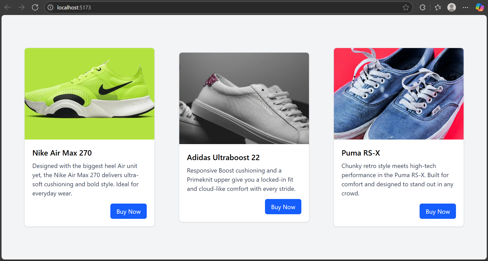

# 🛍️ React Product Card Showcase

This is a simple React project that displays multiple **product cards** using **reusable components** and **props**. The app highlights core React concepts like passing data through props to customize components.

---

## 🚀 Features

- Reusable `Card` component
- Props used to dynamically pass title, description, image, and button text
- Clean and responsive UI using Tailwind CSS

---

## 🖼️ App Screenshot

## 

## 🧠 What I Learned in This Project

### 🔹 Props in React

- Props (short for "properties") are used to pass data from **parent to child components** in React.
- In this project, each `<Card />` receives props like:

```jsx
<Card
  title="Nike Air Max 270"
  description="Designed with the biggest heel Air unit yet..."
  imgSrc="https://img.url"
  buttonText="Buy Now"
/>
```

- The `Card` component accepts these props as function arguments:

```jsx
function Card({ title, description, imgSrc }) {
  return (
    <div>
      
      <h2>{title}</h2>
      <p>{description}</p>
    </div>
  );
}
```

> **Remember:** Props are **read-only** and are used to make components **dynamic and reusable**.

---

## 🧱 Technologies Used

- React (Vite or CRA)
- Tailwind CSS for styling
- JavaScript (ES6+)

---

## ✨ Future Improvements

- Add a dynamic cart system
- Add price prop and rating stars
- Animate the cards with Framer Motion
- Load card data from a JSON or API file

---

## 🙌 About

**Mohammed Shafi**  
React Beginner | Practicing with small components | This is my **Props learning project** 🔁
