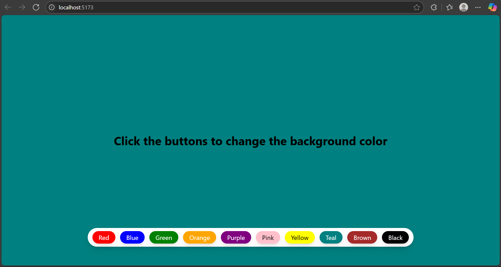

# 🎨 React Background Color Changer

This is a simple and interactive React project that allows users to change the background color of a container by clicking on different color buttons. It was built as part of my learning journey in React and JavaScript fundamentals.

---

## 🚀 Features

- 10 color buttons (Red, Blue, Green, etc.)
- Changes background color dynamically
- Uses React `useState` hook
- Responsive layout using Tailwind CSS
- Simple and clean UI

---

## 🖼️ App Screenshot

## 

## 📚 What I Learned

### ✅ React State Management

- Used the `useState` hook to manage dynamic values such as background color.
- Updating state triggers automatic re-rendering of components in React.

### ✅ Event Handling in React

One of the key takeaways from this project was understanding **how event handling works in React**, especially the difference between **immediate execution** and **function reference**.

#### 🔍 Why `onClick={() => setColor("Red")}` and not `onClick={setColor("Red")}`?

| Syntax                            | Behavior                                       |
| --------------------------------- | ---------------------------------------------- |
| `onClick={setColor("Red")}`       | ❌ Runs immediately when the component renders |
| `onClick={() => setColor("Red")}` | ✅ Runs **only when the button is clicked**    |

- In React, event handlers must be **functions**, not the result of a function call.
- So if you write `onClick={setColor("Red")}`, it executes instantly — which is not what we want.
- Instead, we wrap it in an arrow function: `() => setColor("Red")`, which tells React to **wait** and only run it when the event (click) happens.

#### 📘 This concept applies to many other events:

- `onChange`
- `onSubmit`
- `onMouseEnter`, `onMouseLeave`
- `onKeyDown`, etc.

---

## 🛠️ Technologies Used

- **React** (Vite or Create React App)
- **JavaScript (ES6+)**
- **Tailwind CSS**

---
