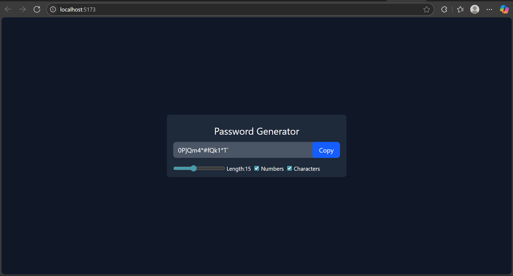

# 🔐 Password Generator – React Project

This is a fully functional **Password Generator** built using **React**. It allows users to:

- Generate secure passwords
- Control the length (6 to 30)
- Optionally include numbers and special characters
- Copy the generated password to the clipboard

---

## 📸 UI Features

- Clean UI with Tailwind CSS
- Password shown in a read-only input
- Slider to set password length
- Checkboxes to include **numbers** and/or **special characters**
- "Copy" button changes to "Copied!" on click and resets after 2 seconds

---

## 🖼️ App Screenshot



---

## 🧠 What I Learned in This Project

### 1. `useCallback`

- ✅ Used to **memoize** functions so they're not recreated unnecessarily on every render.
- Helps with **performance**, especially when passing functions as dependencies to `useEffect`.
- Example in this project:

```js
const passGenerator = useCallback(() => {
  // password generation logic
}, [length, isNum, isChar, setPass]);
```

- Similarly used for the copy handler:

```js
const copyToCB = useCallback(() => {
  // clipboard + button text logic
}, [pass]);
```

> **Remember:** Use `useCallback` when a function is passed as a dependency or prop to avoid re-renders.

---

### 2. `useEffect`

- ✅ Used to **run side-effects** when dependencies change.
- In this app, it watches for changes to `length`, `isNum`, or `isChar`, and regenerates the password automatically.

```js
useEffect(() => {
  passGenerator();
}, [length, isNum, isChar, passGenerator]);
```

> **Remember:** `useEffect` runs **after the render**, and only when **dependencies** change.

---

### 3. `useRef`

- ✅ Used to reference DOM elements directly (like buttons or input fields).
- Helpful for:
  - Selecting the password input text for clipboard
  - Changing the "Copy" button text dynamically

```js
const passRef = useRef(null);
const btnTextRef = useRef(null);
```

```js
passRef.current?.select();
btnTextRef.current.innerText = "Copied!";
```

> **Remember:** `useRef` gives you direct access to DOM elements without re-rendering the component.

---

## 🛠️ How It Works (Logic Overview)

1. **Password Pool Building:**

   - Base letters (A–Z, a–z) are always included
   - Numbers and symbols are added to the pool if selected

2. **Guaranteed Inclusion:**

   - If numbers/symbols are selected, one character from each is **forced** into the password

3. **Random Fill + Shuffle:**

   - Remaining characters are randomly selected from the full pool
   - Password is then **shuffled** using `.sort(() => 0.5 - Math.random())` to ensure randomness

4. **Copy Functionality:**
   - Uses `navigator.clipboard.writeText()`
   - Button text changes to **"Copied!"** and reverts to **"Copy"** after 2 seconds

---

## 🚀 Technologies Used

- React (Vite)
- Tailwind CSS
- JavaScript (ES6+)
- React Hooks (`useState`, `useEffect`, `useCallback`, `useRef`)

---

## 📌 Future Improvements

- Add password strength meter (Weak / Strong / Very Strong)
- Add option to exclude similar-looking characters (like `l`, `1`, `I`, `O`, `0`)
- Add dark/light theme toggle
- Export as `.txt` or download password button

---

## 🧠 Quick Revision Summary

| Hook          | Use Case                                     |
| ------------- | -------------------------------------------- |
| `useState`    | Store password, length, toggle options       |
| `useCallback` | Avoid recreating functions on every render   |
| `useEffect`   | Automatically generate password on changes   |
| `useRef`      | DOM manipulation (select input, change text) |

---

## 🙌 About

**Mohammed Shafi**  
Beginner React Developer  
This is my **4th React project**. Each project is helping me understand React deeper 🚀
