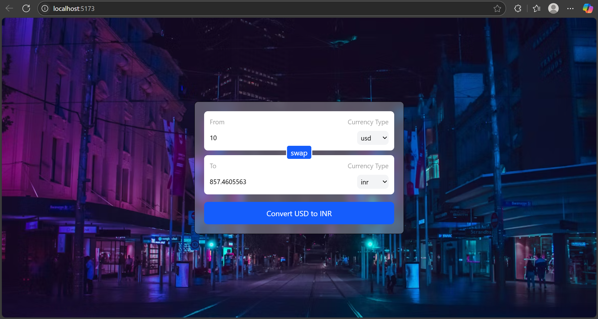

# 💱 Currency Converter – React Project

This is a currency converter app built with React. It allows users to convert amounts from one currency to another using real-time data fetched from an open API.

---

## 🧠 What I Learned

### 🔹 Custom Hooks

- Built a custom hook `useCurrencyInfo(currency)` to fetch and return currency exchange rates based on the selected "from" currency.
- Helps encapsulate reusable logic and keep components clean.

### 🔹 Fetch API

- Used the Fetch API to get real-time currency data from:
  ```
  https://cdn.jsdelivr.net/npm/@fawazahmed0/currency-api@latest/v1/currencies/
  ```
- Parsed and stored the response using React's `useState`.

### 🔹 React Concepts

- `useState` to manage amount, selected currencies, and converted value.
- `useEffect` to re-fetch data when the base currency changes.
- Controlled inputs for real-time user interaction.
- Form handling with `onSubmit`.

---

## 📦 Technologies Used

- React (Vite)
- Tailwind CSS for responsive UI
- JavaScript ES6+
- Free Currency API by [Fawaz Ahmed](https://github.com/fawazahmed0/currency-api)

---

## 🖼️ UI Preview

```



```

---

## 🚀 How to Run

1. Clone the repository:

```bash
git clone https://github.com/your-username/react-mini-projects.git
cd react-mini-projects/06_currency-converter
```

2. Install dependencies:

```bash
npm install
```

3. Start the development server:

```bash
npm run dev
```

---

## 🙏 Acknowledgment

🧑‍🏫 Learning React by following tutorials from [Hitesh Choudhary](https://github.com/hiteshchoudhary)

---

## 🙌 Author

**Mohammed Shafi**  
React Learner | Exploring hooks, APIs, and real-world UI in small steps.
