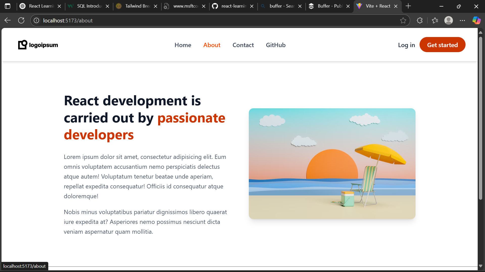

# React Router DOM Project 🚀

This project is a practical implementation of React Router DOM v6+. It showcases the usage of client-side routing in a React application using `react-router-dom`.

---

## 📚 Topics I Learned

### 🔄 1. React Router DOM Setup

- Installed `react-router-dom` and wrapped the entire app with `<RouterProvider>`.
- Created a custom `router` using `createBrowserRouter()` to define routes.

### 🧩 2. Nested Routes with Layouts

- Used a `Layout` component to define a shared layout structure.
  - Included a `<Header />`, `<Footer />`, and `<Outlet />` to render nested routes.

### 🌐 3. Route Configuration

```jsx
const router = createBrowserRouter([
  {
    path: "/",
    element: <Layout />,
    children: [
      { path: "", element: <Home /> },
      { path: "about", element: <About /> },
      { path: "contact", element: <Contact /> },
      { path: "user/:userid", element: <User /> },
      { loader: githubInfoLoader, path: "github", element: <Github /> },
    ],
  },
]);
```

- Nested routing structure allows clean component hierarchy.
- Used `:userid` as a dynamic route parameter.

### 🔗 4. Link vs NavLink

- `Link` is used for basic navigation.
- `NavLink` is used for navigation with **active class styling** to indicate current page.

### 🆔 5. useParams Hook

- Extracted dynamic route parameters (like user ID) using `useParams()` in `User.jsx`.

```jsx
const { userid } = useParams();
```

### 📦 6. useLoaderData & Loaders

- Used `loader` function with route to fetch GitHub data **before** rendering `Github` component.
- Accessed preloaded data with `useLoaderData()` for improved performance.

```js
export const githubInfoLoader = async () => {
  const response = await fetch("https://api.github.com/users/shafi3m");
  return response.json();
};
```

---

## 🧪 Components Used

| Component          | Description                                               |
| ------------------ | --------------------------------------------------------- |
| `Layout`           | Common structure for all pages (Header + Outlet + Footer) |
| `Home`             | Simple landing page                                       |
| `About`, `Contact` | Static informational pages                                |
| `User`             | Shows dynamic user route using route params               |
| `Github`           | Displays fetched GitHub user data using `loader`          |

---

## 🛠 Technologies

- React ⚛️
- React Router DOM v6+
- JSX & Functional Components
- Tailwind CSS for styling

---



## 🙋‍♂️ Author Note

This project is part of my React learning journey under the mentorship of **Hitesh Choudhary**.  
It helped me understand the power of React Router DOM and how to structure a multi-page SPA using nested routes, route parameters, and loaders.

---
