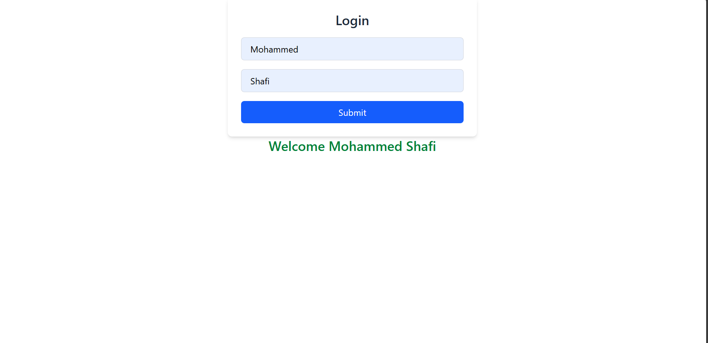

## 📘 React Context API Project — Login & Profile App

This mini-project helped me **learn and revise Context API in React**, including how to **share state globally across components** without prop drilling.

---

### 🔍 What I Learned (Great for Revision)

#### 🧠 `React.createContext()`

- Used to **create a Context object** that allows passing data through the component tree without manually passing props at every level.

#### 🧠 `useContext()`

- Hook to **consume context values** anywhere in the component tree (like `user`, `setUser`) — no need to pass props manually.

#### 🧠 Context Provider Pattern

- **Provider component** wraps the entire app, exposing values (`user`, `setUser`) to all components.
- Only components inside this wrapper can access the context.

#### 🧠 `useState()` in Context

- State is created in the provider and updated using `setUser`.
- All components consuming the context will re-render on change.

#### 🧠 Conditional Rendering

- The `Profile` component conditionally renders a welcome message **only if** both first and last names are filled.

---

### 🛠 Folder Structure (For Quick Reference)

```
src/
│
├── App.jsx                    # Renders Login and Profile inside the provider
│
├── Components/
│   ├── login.jsx              # Collects user input (first and last name)
│   └── profile.jsx            # Displays "Welcome FirstName LastName"
│
├── Context/
│   ├── UserContext.jsx        # Context object created using createContext()
│   └── UserContextProvider.jsx# Provider holding user state using useState
```

---

### 🔁 App Flow (Revision Checklist ✅)

1. **UserContext** is created  
   ➤ `const UserContext = createContext();`

2. **UserContextProvider** holds the state  
   ➤ `const [user, setUser] = useState(null);`  
   ➤ Passed via `<UserContext.Provider value={{ user, setUser }}>`

3. **Login component** uses `useContext()`  
   ➤ Calls `setUser({ Fname, Lname })` when submitted

4. **Profile component** uses `useContext()`  
   ➤ Renders "Welcome Firstname Lastname" if `user` exists  
   ➤ Else: Shows "Enter your full name"

---

### 💻 Technologies Used

- React (`useContext`, `useState`)
- Context API
- Tailwind CSS (UI styling)
- Functional Components

---



### ✍️ Summary (Final Revision Points)

- Context API is a **React feature to manage global state**.
- `createContext()` ➤ Creates context.
- `useContext()` ➤ Reads from context.
- `Provider` ➤ Wraps components and **provides state**.
- No prop drilling needed — makes state sharing simple and scalable.

---

### 🎓 Course Credit

> This project was built as part of my React learning journey  
> 👉 **Instructor**: _Hitesh Choudhary_
