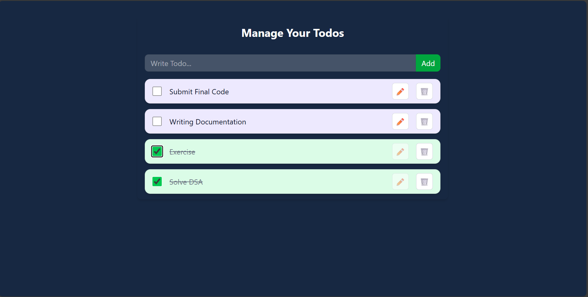

# 📝 React Todo App with Context API & Local Storage

A fully functional Todo application built using **React**, leveraging the **Context API** for global state management and **localStorage** for persistent data storage in the browser.

---

## 📸 Screenshot



---

## ✨ Features

- ➕ Add new todos
- ✏️ Edit todos inline
- ✅ Mark todos as completed
- ❌ Delete todos
- 🔁 Toggle completion status
- 📂 Persistent data via `localStorage`
- ♻️ Global state with React Context API

---

## 📚 What I Learned

| Concept             | Description                                        |
| ------------------- | -------------------------------------------------- |
| `useState()`        | Manage todo list, input, and editing state         |
| `useEffect()`       | Load todos on mount and sync with `localStorage`   |
| Context API         | Centralized state and shared logic                 |
| `useContext()`      | Access shared state and functions in any component |
| `localStorage`      | Persistent browser-based data storage              |
| Reusable Components | Modular design with `TodoForm` and `TodoItem`      |

---

## 🗂️ Folder Structure

```
📁 src
├── 📂 Components
│   ├── TodoForm.jsx        // Input form to add todos
│   └── TodoItem.jsx        // Each todo item (edit/delete/toggle)
├── 📂 Context
│   └── TodoContext.js      // Context setup and provider
├── App.jsx                 // App layout and logic
└── main.jsx                // App entry point
```

---

## ⚙️ How It Works (Step-by-Step)

### 1. Context API (`TodoContext.js`)

- `createContext()` initializes a global todo store.
- Provides shared logic: `addTodo`, `updateTodo`, `deleteTodo`, `toggleComplete`.
- A custom hook `useTodo()` exposes the context to child components.

### 2. App Wrapper (`App.jsx`)

- Wraps all UI components inside `<TodoProvider>`.
- Maintains todos via `useState([])`.

### 3. Syncing with Local Storage

**On Mount:**

```js
useEffect(() => {
  const todos = JSON.parse(localStorage.getItem("todos"));
  if (todos?.length) setTodos(todos);
}, []);
```

**On Change:**

```js
useEffect(() => {
  localStorage.setItem("todos", JSON.stringify(todos));
}, [todos]);
```

### 4. Adding a Todo (`TodoForm.jsx`)

- Form input + submit button.
- On submission:  
  `addTodo({ id: Date.now(), todo: string, completed: false })`

### 5. Displaying Todos (`TodoItem.jsx`)

- Shows:
  - ✅ Checkbox
  - ✏️ Editable text input
  - 🗑️ Delete button
- If a todo is marked completed, editing is disabled.

### 6. Updating & Deleting

- **Edit:** Enables inline editing and saves via `updateTodo()`.
- **Delete:** Removes the item via `deleteTodo(id)`.

---

## 🧠 Why Context API?

Using Context API:

- 🔄 Avoids prop drilling across components
- 📦 Centralizes state and logic
- 🧼 Keeps components clean and decoupled
- 🚀 Scales better for future features

---

## ✅ Final Notes

This project helped reinforce:

- ✅ Clean React component design
- ✅ Core understanding of the Context API
- ✅ Real-world usage of `localStorage`
- ✅ Writing scalable, modular, and reusable components

---
